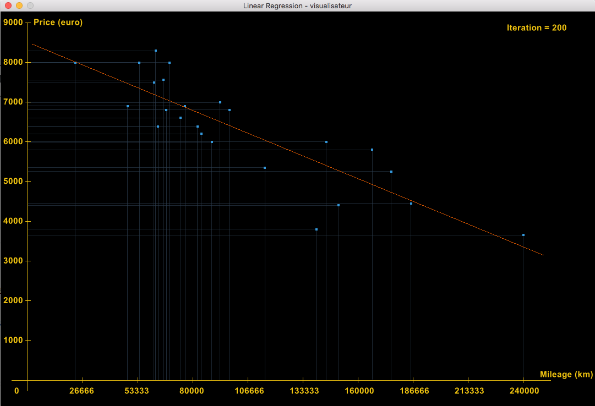

# linear regression

visualisateur => Gosu https://github.com/gosu/gosu/wiki/ruby-tutorial
algo => gradient descent

Project:
The aim of this project is to introduce you to the basic concept behind machine learning.
For this project, you will have to create a program that predicts the price of a car
by using a linear function train with a gradient descent algorithm.

usage for train:
    
    $ ruby train.rb [--visualisateur] [--variance]

if --visualisateur is active, visualisateur.txt as write.

usage for train:
    
    $ ruby estimate.rb [Price]
    
usage for visualisateur
    
    $ ruby visualisateur.rb

